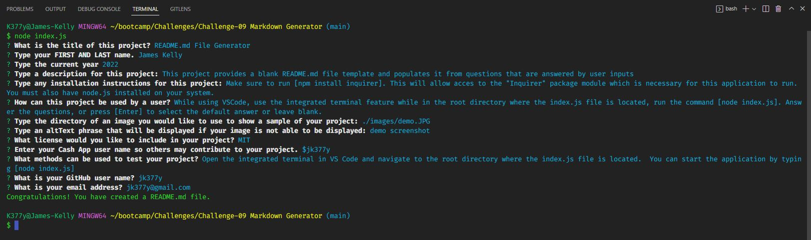

# README.md File Generator
 

## Description
This project provides a blank README.md file template and populates it from questions that are answered by user inputs

## Table of Contents
- [Installation](#installation)
- [Usage](#usage)
- [License](#license)
- [Contributing](#contributing)
- [Tests](#tests)
- [Questions](#questions)

## Installation
Make sure to run [npm install inquirer]. This will allow acces to the "Inquirer" package module which is necessary for this application to run. You must also have node.js installed on your system.

## Usage
While using VSCode, use the integrated terminal feature while in the root directory where the index.js file is located, run the command [node index.js]. Answer the questions, or press [Enter] to select the default answer or leave blank.
 

## License
License: MIT
  
 Information on this license can be found at: (https://opensource.org/licenses/MIT)
 Copyright (c) 2022 James Kelly

## Contributing
Help support me by donating with Cash App $JK377Y

## Tests
Open the integrated terminal in VS Code and navigate to the root directory where the index.js file is located.  You can start the application by typing [node index.js]

## Questions
For Questions, I can be reached at the following:
 GitHub:  https://github.com/jk377y
 OR
 Email:  jk377y@gmail.com

